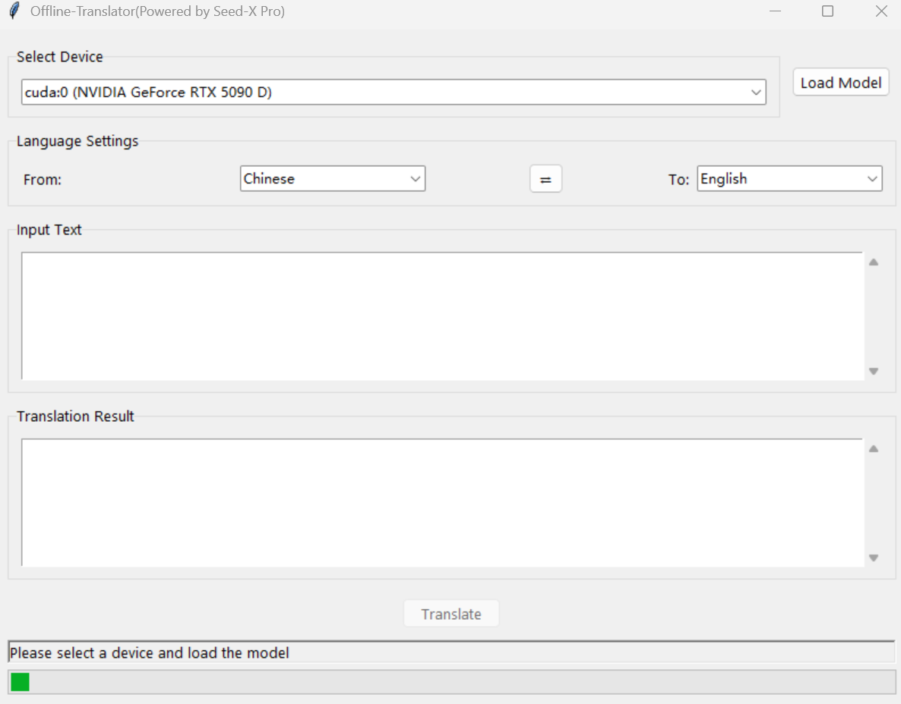

# Offline-Translator (Powered by Seed-X)

A privacy-focused offline AI translation application built with Transformers and Tkinter, providing secure local translation without sending data to external servers.



> **⚠️ IMPORTANT NOTICE**: This repository contains placeholder model files. You must download the actual model files (~14GB) before running the application. See [Installation](#-installation) section for details.

## ✨ Key Features

- 🤖 **Local AI Translation** - Complete privacy protection with offline processing
- 🌍 **Multi-language Support** - Bidirectional translation between 8 languages (Chinese, English, Spanish, French, German, Japanese, Korean, Russian)
- ⚡ **GPU Acceleration** - Automatic GPU detection with CUDA support for faster translation
- 🎨 **Modern Interface** - Clean, intuitive graphical user interface
- ⌨️ **Keyboard Shortcuts** - Rich hotkey support for efficient workflow
- 📋 **One-click Copy** - Easy result copying to clipboard
- 🔄 **Quick Language Swap** - Instant source/target language switching
- 📏 **Smart Text Limits** - 5000 character limit with helpful user guidance

## 🔧 System Requirements

- **Python**: 3.8 or higher
- **PyTorch**: Latest stable version
- **Transformers**: Hugging Face transformers library
- **Accelerate**: For optimized model loading
- **Tkinter**: GUI framework (usually included with Python)

## 📦 Installation

1. **Clone the repository:**
```bash
git clone https://github.com/your-username/offline-translator.git
cd offline-translator
```

2. **Install dependencies:**
```bash
pip install -r requirements.txt
```

3. **⚠️ IMPORTANT: Download Model Files**
   
   **The repository contains placeholder model files. You MUST download the actual model before running the application.**
   
   - 📁 Navigate to the `models/` directory
   - 📖 Read the `README.txt` file for detailed download instructions
   - 🔗 Download the model files (~14GB) from the provided links
   - 📋 Replace the placeholder `model.safetensors` (0KB) with the actual model file
   
   **Quick Setup:**
   ```bash
   # After cloning, check the models directory
   cd models/
   cat README.txt  # Read download instructions
   
   # Download model files from the provided links
   # Replace model.safetensors with the downloaded file (~14GB)
   ```

4. **Verify Installation:**
   - Ensure `model.safetensors` is approximately 14GB (not 0KB)
   - All JSON configuration files should contain actual data
   - Run the application to test: `python translator.py`

## 🚀 Usage

1. **Launch the application:**
```bash
python translator.py
```

2. **Setup process:**
   - Select your preferred device (GPU recommended for speed)
   - Click "Load Model" to initialize the translation engine
   - Choose source and target languages
   - Enter text (up to 5000 characters)
   - Click "Translate" or press `Ctrl+Enter`

## ⌨️ Keyboard Shortcuts

| Shortcut | Action |
|----------|--------|
| `Ctrl+Enter` | Translate text |
| `Ctrl+L` | Load model |
| `Ctrl+Shift+C` | Copy translation result |
| `Ctrl+Shift+X` | Clear input text |
| `Ctrl+Shift+S` | Swap source and target languages |
| `F1` | Show help information |

## 🖥️ Interface Features

### Device Selection
- **Automatic GPU Detection** - Scans for available CUDA devices
- **GPU Priority** - Graphics cards listed first, CPU as fallback
- **Device Information** - Shows GPU names for easy identification

### Language Management
- **8 Language Support** - Comprehensive language coverage
- **Bidirectional Translation** - Translate between any supported language pair
- **Quick Swap Button** (⇄) - Instantly reverse translation direction
- **Smart Validation** - Prevents selecting identical source/target languages

### Text Processing
- **Scrollable Text Areas** - Handle long texts comfortably
- **5000 Character Limit** - Optimized for quality and performance
- **Clear Warnings** - Helpful messages when text exceeds limits
- **Copy/Clear Functions** - Easy text management

### Translation Optimization
- **Advanced Prompting** - Optimized prompts for better translation quality
- **Smart Output Cleaning** - Removes artifacts and explanatory text
- **Tuned Parameters** - Optimized generation settings for accuracy

## 📁 Model Structure

Your `models/` directory should contain:

```
models/
├── config.json              # Model configuration
├── model.safetensors        # Model weights
├── tokenizer.json           # Tokenizer configuration
└── generation_config.json   # Generation parameters
```

## 🔧 Technical Features

### Memory Optimization
- **Efficient Loading** - Uses `accelerate` library for optimized memory usage
- **Mixed Precision** - `bfloat16` support to reduce VRAM consumption
- **Smart Device Management** - Automatic device allocation and detection

### Error Handling
- **Global Exception Handling** - Comprehensive error catching
- **Detailed Error Messages** - Clear feedback for troubleshooting
- **Automatic Logging** - Errors saved to `error_log.txt`

### User Experience
- **Multi-threading** - Non-blocking UI during translation
- **Real-time Progress** - Live status updates and progress indicators
- **Responsive Design** - Smooth interaction and feedback

## 🛠️ Troubleshooting

### Common Issues

**Model Loading Fails**
- Verify all model files are present in `models/` directory
- Check file permissions and integrity
- Ensure sufficient disk space

**CUDA Errors**
- Confirm PyTorch CUDA compatibility
- Update GPU drivers
- Check CUDA installation

**Memory Issues**
- Try CPU mode for large models
- Reduce input text length
- Close other GPU-intensive applications

**Poor Translation Quality**
- Verify model compatibility with selected language pair
- Check if model is specifically trained for translation
- Try shorter, simpler sentences

## 📄 License

This project is licensed under the MIT License - see the LICENSE file for details.

## 🤝 Contributing

Contributions are welcome! Please feel free to submit a Pull Request.

## 📞 Support

If you encounter any issues or have questions, please open an issue on GitHub.