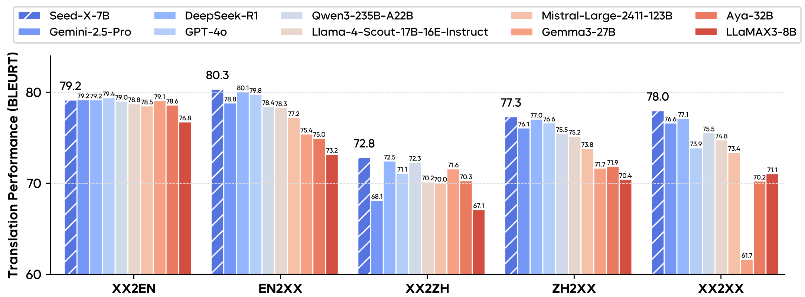
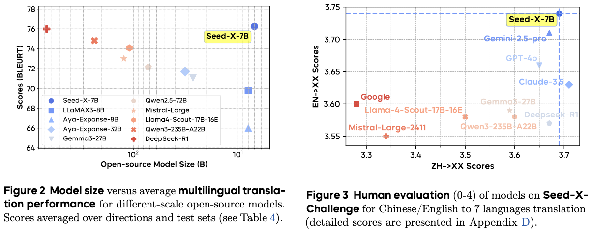

# Seed-X-PPO-7B
<a href="https://arxiv.org/pdf/2507.13618">
  </a>
<a href="XXXX">
  </a>
<a href="https://github.com/ByteDance-Seed/Seed-X-7B/blob/main/LICENSE.openmdw">
  </a>

## Introduction
We are excited to introduce **Seed-X**, a powerful series of open-source multilingual translation language models, including an instruction model, a reinforcement learning model, and a reward model. It pushes the boundaries of translation capabilities within 7 billion parameters.
We develop Seed-X as an accessible, off-the-shelf tool to support the community in advancing translation research and applications:
* **Exceptional translation capabilities**: Seed-X exhibits state-of-the-art translation capabilities, on par with or outperforming ultra-large models like Gemini-2.5, Claude-3.5, and GPT-4, as validated by human evaluations and automatic metrics.
* **Deployment and inference-friendly**: With a compact 7B parameter count and mistral architecture, Seed-X offers outstanding translation performance in a lightweight and efficient package, ideal for deployment and inference.
* **Broad domain coverage**: Seed-X excels on a highly challenging translation test set spanning diverse domains, including the internet, science and technology, office dialogues, e-commerce, biomedicine, finance, law, literature, and entertainment.


This repo contains the **Seed-X-PPO** model, with the following features:
* Type: Causal language models
* Training Stage: Pretraining & Post-training
* Support: Multilingual translation among 28 languages
  
（We recommend using Seed-X-PPO model, as its translation performance is superior to Seed-X-Instruct.）
| Languages  | Abbr. | Languages  | Abbr. | Languages  | Abbr. | Languages  | Abbr. |
| ----------- | ----------- |-----------|-----------|-----------|-----------| -----------|-----------|
|Arabic | ar  |French              | fr  | Malay            |  ms  | Russian                   | ru                                | 
|Czech  | cs  |Croatian            | hr  | Norwegian Bokmal |  nb                   | Swedish  | sv                | 
|Danish  | da |Hungarian           | hu  |  Dutch           | nl                    |  Thai                      | th      | 
|German  | de |Indonesian          | id  | Norwegian        | no | Turkish                   | tr                   | 
|English | en |Italian             | it  | Polish           | pl  | Ukrainian                 | uk           | 
|Spanish | es |Japanese            | ja  | Portuguese       | pt   | Vietnamese                | vi                   | 
|Finnish | fi |Korean              | ko  | Romanian         | ro                  | Chinese                   | zh  | 

## Model Downloads
| Model Name  | Description | Download |
| ----------- | ----------- |-----------
| Seed-X-Instruct  | Instruction-tuned for alignment with user intent. |🤗 [Model]()|
| 👉 **Seed-X-PPO** | RL trained to boost translation capabilities.     | 🤗 [Model]()|
|Seed-X-RM | Reward model to evaluate the quality of translation.|  🤗 [Model]()| 

## Quickstart

📮 **Notice**
* **The language tags at the end of the prompt is necessary**, which are used in PPO training. For example, when the target language is German, \<de\> needs to be added. You can refer to the above table for language abbreviations.
* **This model is specialized in multilingual translation**, which is unexpected to support other tasks. 
* **We don't have any chat template**, thus you don't have to perform ```tokenizer.apply_chat_template```. Please avoid prompting the model in a multi-round conversation format.
* **We recommend against using unofficial quantized versions for local deployment.** We will soon release an official quantized model and develop a demo on Hugging Face Space.

Here is a simple example demonstrating how to load the model and perform translation using ```vllm```

Recommended:```vllm==0.8.0, transformers==4.51.3```

```python
from vllm import LLM, SamplingParams, BeamSearchParams

model_path = "./ByteDance-Seed/Seed-X-PPO-7B"

model = LLM(model=model_path,
            max_num_seqs=512,
            tensor_parallel_size=8,
            enable_prefix_caching=True, 
            gpu_memory_utilization=0.95)

messages = [
    # without CoT
    "Translate the following English sentence into Chinese:\nMay the force be with you <zh>",
    # with CoT
    "Translate the following English sentence into Chinese and explain it in detail:\nMay the force be with you <zh>" 
]

# Beam search (We recommend using beam search decoding)
decoding_params = BeamSearchParams(beam_width=4,
                                   max_tokens=512)
# Greedy decoding
decoding_params = SamplingParams(temperature=0,
                                 max_tokens=512,
                                 skip_special_tokens=True)

results = model.generate(messages, decoding_params)
responses = [res.outputs[0].text.strip() for res in results]

print(responses)
```
## Evaluation
We evaluated Seed-X on a diverse set of translation benchmarks, including FLORES-200, WMT-25, and a publicly released [challenge set](https://github.com/ByteDance-Seed/Seed-X-7B/tree/main/challenge_set) accompanied by human evaluations.

For detailed benchmark results and analysis, please refer to our [Technical Report](https://arxiv.org/pdf/2507.13618).

## License
This project is licensed under OpenMDW. See the [LICENSE](https://github.com/ByteDance-Seed/Seed-X-7B/blob/main/LICENSE.openmdw) file for details.

## Citation
If you find Seed-X useful for your research and applications, feel free to give us a star ⭐ or cite us using:
```bibtex
@misc{cheng2025seedxbuildingstrongmultilingual,
      title={Seed-X: Building Strong Multilingual Translation LLM with 7B Parameters}, 
      author={Shanbo Cheng and Yu Bao and Qian Cao and Luyang Huang and Liyan Kang and Zhicheng Liu and Yu Lu and Wenhao Zhu and Jingwen Chen and Zhichao Huang and Tao Li and Yifu Li and Huiying Lin and Sitong Liu and Ningxin Peng and Shuaijie She and Lu Xu and Nuo Xu and Sen Yang and Runsheng Yu and Yiming Yu and Liehao Zou and Hang Li and Lu Lu and Yuxuan Wang and Yonghui Wu},
      year={2025},
      eprint={2507.13618},
      archivePrefix={arXiv},
      primaryClass={cs.CL},
      url={https://arxiv.org/abs/2507.13618}, 
}
```